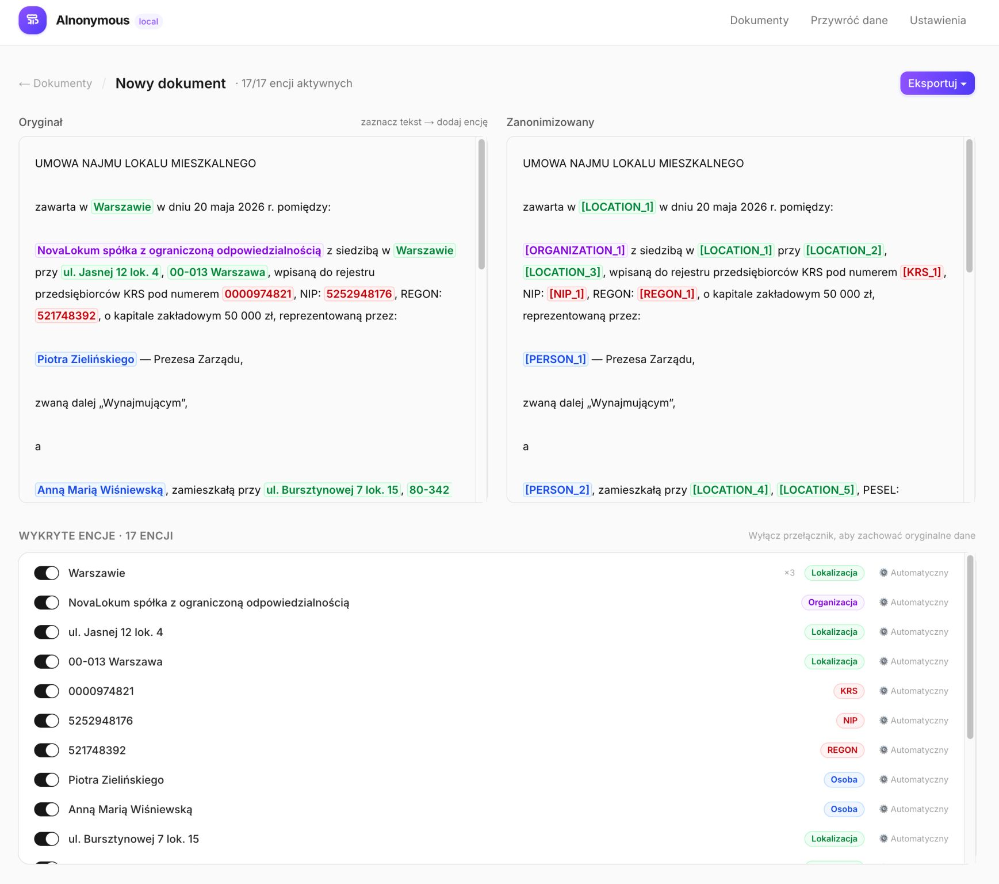

# AInonymous

Lokalne narzędzie do anonimizacji dokumentów prawnych w języku polskim.

AInonymous automatycznie wykrywa dane osobowe w dokumentach (imiona, nazwiska, adresy, numery PESEL, NIP, REGON, KRS, numery telefonów, adresy e-mail i inne) i zamienia je na oznaczenia typu `[PERSON_1]`, `[LOCATION_2]` itp. Cały proces odbywa się lokalnie — Twoje dokumenty nie opuszczają Twojego komputera.



---

## Co jest potrzebne

- **Docker Desktop** — darmowy program do uruchamiania aplikacji w kontenerach
- **Ollama** *(opcjonalnie)* — tylko jeśli chcesz korzystać z dodatkowej analizy kontekstowej przez lokalne AI

---

## Krok 1: Zainstaluj Docker Desktop

### Windows

1. Wejdź na stronę: https://www.docker.com/products/docker-desktop/
2. Kliknij **Download for Windows**
3. Uruchom pobrany plik instalacyjny i postępuj zgodnie z instrukcjami
4. Po instalacji uruchom **Docker Desktop** — w zasobniku systemowym (przy zegarku) pojawi się ikona wieloryba
5. Poczekaj aż ikona przestanie się animować — to znaczy, że Docker jest gotowy

**Uwaga dla Windows:** Docker wymaga włączonej funkcji WSL 2. Instalator zazwyczaj włącza ją automatycznie. Jeśli pojawi się błąd, uruchom PowerShell jako administrator i wpisz: `wsl --install`, a następnie zrestartuj komputer.

### Mac

1. Wejdź na stronę: https://www.docker.com/products/docker-desktop/
2. Kliknij **Download for Mac** (wybierz wersję odpowiednią dla Twojego procesora — Apple Silicon lub Intel)
3. Otwórz pobrany plik `.dmg` i przeciągnij Docker do folderu Aplikacje
4. Uruchom **Docker Desktop** z folderu Aplikacje
5. Poczekaj aż ikona Dockera na pasku menu przestanie się animować

---

## Krok 2: Pobierz i uruchom AInonymous

### Sposób A: Z terminala (zalecany)

Otwórz terminal (Windows: PowerShell, Mac: Terminal) i wpisz kolejno:

```
git clone https://github.com/marcin-lejman/ainonymous.git
cd ainonymous
docker compose up --build
```

**Pierwsze uruchomienie potrwa kilka minut** — Docker pobiera biblioteki językowe potrzebne do rozpoznawania tekstu (~1 GB). Kolejne uruchomienia będą znacznie szybsze, bo dane zostaną zapisane w pamięci podręcznej.

Gdy zobaczysz w terminalu komunikat `Uvicorn running on...`, aplikacja jest gotowa.

Otwórz przeglądarkę i wejdź na: **http://localhost:3000**

Aby zatrzymać aplikację, wciśnij `Ctrl+C` w terminalu.

**Kolejne uruchomienia:** Nie musisz powtarzać całej procedury. Wystarczy otworzyć terminal w folderze `ainonymous` i wpisać:

```
docker compose up
```

(Bez `--build` — obraz jest już zbudowany, start zajmie kilka sekund.)

### Sposób B: Z interfejsu Docker Desktop

Jeśli nie chcesz korzystać z terminala:

1. Pobierz repozytorium jako ZIP: https://github.com/marcin-lejman/ainonymous/archive/refs/heads/main.zip
2. Rozpakuj archiwum w wybranym folderze
3. Otwórz **Docker Desktop**
4. Przejdź do zakładki **Images** w lewym menu — nie znajdziesz tam jeszcze obrazu AInonymous, bo trzeba go najpierw zbudować
5. Niestety Docker Desktop nie pozwala zbudować obrazu z `docker-compose.yml` przez GUI — musisz otworzyć terminal w rozpakowanym folderze i wpisać:
   ```
   docker compose up --build
   ```
6. Po zbudowaniu obrazu, kolejne uruchomienia możesz robić z zakładki **Containers** w Docker Desktop — wystarczy kliknąć przycisk Play

---

## Jak korzystać

1. Otwórz **http://localhost:3000** w przeglądarce
2. Kliknij **Nowy dokument**
3. Wklej tekst lub przeciągnij plik (.txt, .docx lub .pdf)
4. Aplikacja automatycznie wykryje dane osobowe
5. Przejrzyj wykryte encje — możesz wyłączyć te, które nie powinny być zanonimizowane
6. Kliknij **Eksportuj** aby pobrać zanonimizowany dokument

---

## Opcjonalnie: Analiza kontekstowa przez lokalne AI

AInonymous może korzystać z lokalnego modelu AI (przez Ollama) do wykrywania dodatkowych identyfikatorów opisowych, np. „jedyna wspólniczka w biurze". Ta funkcja jest całkowicie opcjonalna.

### Instalacja Ollama

1. Wejdź na stronę: https://ollama.com
2. Pobierz i zainstaluj Ollama dla swojego systemu
3. Otwórz terminal i pobierz zalecany model:
   ```
   ollama pull SpeakLeash/bielik-11b-v3.0-instruct:Q4_K_M
   ```
   To polski model językowy (~7 GB do pobrania). Możesz też użyć innych modeli, np.:
   ```
   ollama pull gemma4:e4b-it-q4_K_M
   ```

### Korzystanie z analizy AI

1. Upewnij się, że Ollama działa (po instalacji uruchamia się automatycznie)
2. W AInonymous otwórz dokument po wstępnej anonimizacji
3. Kliknij przycisk **Przeskanuj kontekstem AI**
4. Model przeanalizuje tekst i doda ewentualne dodatkowe encje

Analizę AI możesz skonfigurować w zakładce **Ustawienia** — wybierz model i dostosuj prompt.

---

## Rozwiązywanie problemów

**„port is already allocated" przy uruchamianiu**

Oznacza to, że port 3000 jest zajęty przez inną aplikację. Aby sprawdzić co go zajmuje, wpisz w terminalu:

```
docker ps --filter "publish=3000"
```

Jeśli zobaczysz inny kontener — zatrzymaj go komendą `docker stop <nazwa_kontenera>` i spróbuj ponownie. Jeśli to nie kontener Dockera, zamknij aplikację korzystającą z tego portu (np. inny serwer deweloperski).

---

## Wersja online (demo)

Wersja demonstracyjna dostępna jest pod adresem:

https://ainonymous.up.railway.app

Wersja online nie zawiera analizy AI (brak Ollama) i ma charakter wyłącznie demonstracyjny — do pracy z prawdziwymi dokumentami używaj wersji lokalnej.

---

## Licencja

MIT — szczegóły w pliku [LICENSE](LICENSE).

Aplikacja korzysta z modelu językowego spaCy `pl_core_news_lg`, który jest udostępniony na licencji GPL. Model ten nie jest częścią tego repozytorium — jest pobierany automatycznie podczas budowania obrazu Docker.
